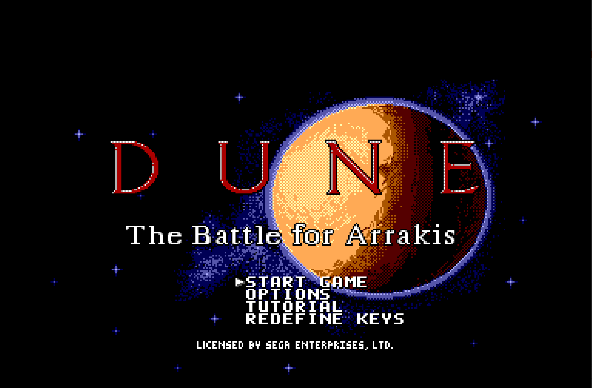
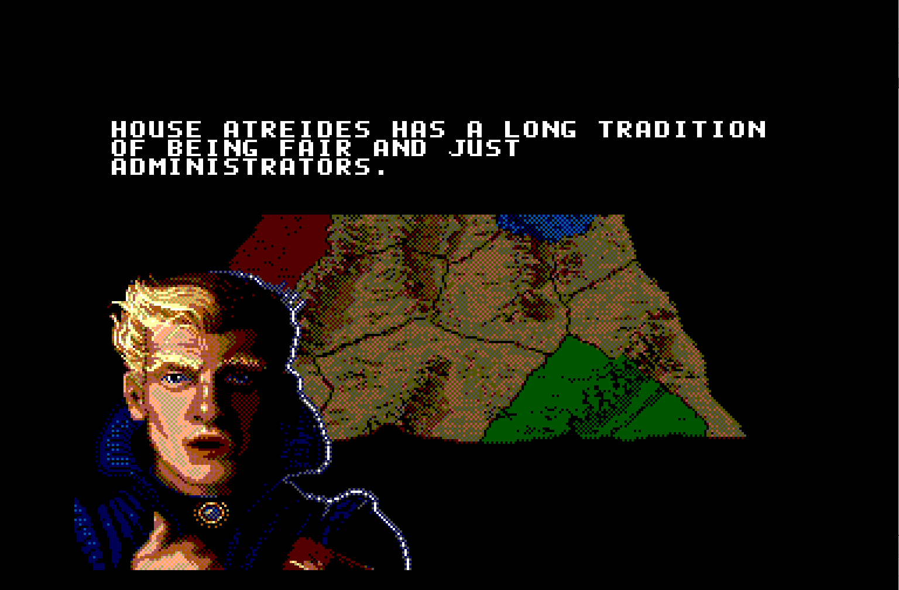
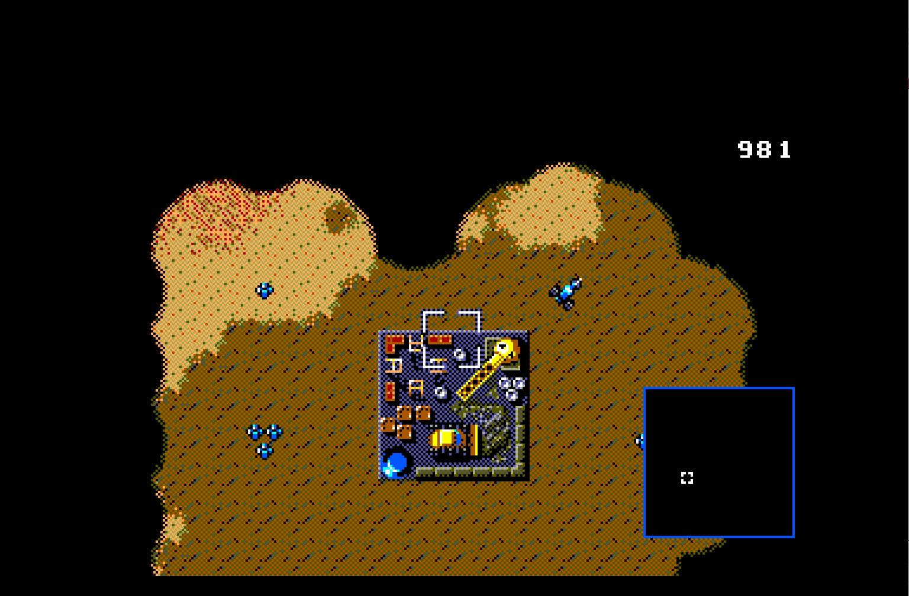
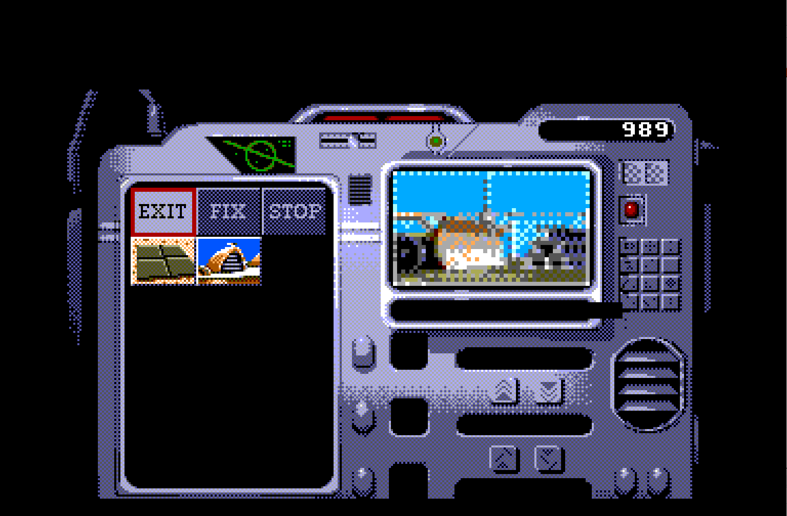

[Русский](#dune-ii-для-zx-evolution) | [English](#dune-ii-for-the-zx-evolution)

# Dune II для ZX Evolution

Порт игры **Dune II - The Battle for Arrakis** с Mega Drive на **ZX
Evolution BaseConf**.

Максимально близко к оригиналу:
- полностью играбельна, с музыкой и звуками
- может работать без карты General Sound (тогда без звука вообще - не рекомендуется)
- собрана с нуля на основе оригинального образа ROM (не прилагается)
- собственный код порта распространяется по лицензии MIT (см. `LICENSE`)

Как собрать самому:
- сборка проверялась только на Ubuntu Linux
- `make toolchain`, `make build`, `make run`

Как запустить:
- положите ./build/dune.trd и ./build/DUNE.DAT в корень SD-карты
- включите Evo
- "file browser" - "mount A:"
- "Run TRDOS"

Полная история сборки и мучений - в каталоге `./prompts`.

## Известные проблемы и планы

- не определяется NeoGS

Буду благодарен за любые отзывы об игровых проблемах.

## Управление

Клавиатура изображает джойпад Mega Drive:

| Клавиши | Пад | |
|---|---|---|
| Q A O P, стрелки, 7 6 5 8, джойстик Kempston | крестовина | движение курсора |
| SPACE, M, огонь | A | выбор; если что-то выбрано - приказ, подходящий к тому, что под курсором: идти, атаковать, собирать спайс, охранять, развернуть; на здании - его панель |
| Z, N | B | назад |
| X, SYMBOL SHIFT (удерживать) | C | крестовина двигает обзор |
| ENTER | Start | настройки |

REDEFINE KEYS в главном меню позволяет назначить каждой кнопке свою клавишу.

## Скриншоты






## Как это сделано

Сначала был разобран картридж Mega Drive, и
поведение игры было записано в виде десяти спецификаций (здесь не
приводятся) - игровой такт битвы, записи объектов, движение, бой,
экономика, производство, ИИ, карта, миссии и экраны; у каждого утверждения
указан адрес 68000, из которого оно взято, и всё проверено на работающем
картридже.  Порт написан на ассемблере Z80 по этим спецификациям, процедура
за процедурой, в банках кода по 16 КБ, которые вызывают друг друга через
трамплин дальнего вызова; записи сохраняют смещения полей картриджа, так
что его ОЗУ и ОЗУ порта можно сравнивать поле за полем.

- **Данные** - из картриджа, в виде текста в `src/res/data/`: типы юнитов
  и зданий, дома, 27 миссий, 27 карт, четыре файла скриптов EMC и все
  строки.
- **Графика** - из картриджа, вырезана из него и из его видеопамяти в PNG
  в его собственных цветах (`src/res/art/`) и конвертируется при сборке:
  для поля боя выбраны шестнадцать цветов, остальные рисуются двухцветной
  шахматкой; спрайты с маской, в четырёх раскрасках домов.
- **Звук** - мелодии и сэмплы картриджа, проигранные через модель его
  звукового драйвера на Z80 и записанные как модули ProTracker
  (`src/res/prebuilt/`); при старте они загружаются в звуковую карту.

Рендерер перерисовывает только те ячейки 8x8, которые изменились с тех пор,
как рисуемый экран показывал их в последний раз, со спрайтами поверх, с
двойной буферизацией; игровой такт битвы занимает около 1,8 кадра, а
игровое время считается в кадрах, как и в картридже.

Что работает и чего не хватает - в `.claude/docs/progress.md`.

## Структура

```
src/            игра на Z80; src/res/ - её данные, графика и звук
tools/          утилиты на Python, эмулятор ZX Evolution и фронтенд
                libretro (оба на C); tools/tests/ - тесты подсистем
bin/            собранное: sjasmplus, evo-run/evo-play, ядра NES и
                Mega Drive, прошивка BaseConf и ПЗУ General Sound
.claude/docs/   порт, машина, графика, игра, сборка, эмулятор, звук,
                утилиты, оригиналы, прогресс
.claude/skills/ как работать с каждой частью
```

Начните с `.claude/docs/port.md` (устройство порта) и
`.claude/docs/platform.md` (что это за машина).

## Благодарности

*Dune II - The Battle for Arrakis* - игра Westwood Studios, изданная
Virgin Interactive в 1992-1994 годах; *Sand Emperor* demo 5 - работа
TI (2021).  ZX Evolution - разработка NedoPC.  Эмулятор построен на
**libxpeccy** из samstyle/Xpeccy; эталонные машины работают на **FCEUmm**
и **Genesis Plus GX** через libretro; ассемблер - **sjasmplus**.  Прошивка
BaseConf и ПЗУ General Sound взяты из дистрибутива ZEsarUX.

Этот репозиторий - порт и проект по сохранению наследия.

---

# Dune II for the ZX Evolution

A port of the Mega Drive **Dune II - The Battle for Arrakis** to the **ZX
Evolution BaseConf**.

As closed as it was possible:
- fully playable with music and sounds
- optional run without GeneralSound card (no sounds at all then - not recommended)
- built from scratch based on original rom file (not included)
- the port's own code is under the MIT License (see `LICENSE`)

How to build yourself:
- pipeline tested on Ubuntu Linux only
- `make toolchain`, `make build`, `make run`

How to run yourself:
- put ./build/dune.trd and ./build/DUNE.DAT in SD card root
- start Evo
- "file browser" - "mount A:"
- "Run TRDOS"

Check `./prompts` directory for full build history and sufferings.

## Known problems and plans

- NeoGS detection does not work

Any feedback on playability issues appreciated.

## Controls

The keyboard is the Mega Drive pad:

| Key | Pad | |
|---|---|---|
| Q A O P, the arrow keys, 7 6 5 8, a Kempston stick | d-pad | move the cursor |
| SPACE, M, fire | A | select; with something selected, the order that fits what is under the cursor - move, attack, harvest, guard, deploy; on a structure, its panel |
| Z, N | B | back |
| X, SYMBOL SHIFT (held) | C | the d-pad moves the view |
| ENTER | Start | the options |

REDEFINE KEYS on the title menu gives each button a key of your own.

## Screens


## How it is made

The Mega Drive cartridge was taken apart first, and
what the game does was written down as ten specifications,
not included here - the battle pass, the records, movement, combat,
the economy, production, the AI, the map, missions and the screens - each
claim with the 68000 address it comes from, and tested against the running
cartridge.  The port is Z80 assembly written from those specs, routine by
routine, in 16 KB code banks that call each other through a far-call
trampoline; the records keep the cartridge's field offsets, so its RAM and
the port's can be compared field by field.

- **The data** is the cartridge's, as text in `src/res/data/`: unit and
  structure types, houses, the 27 missions, the 27 maps, the four EMC
  script files and every string.
- **The pictures** are the cartridge's, cut out of it and out of its video
  memory as PNG in its own colours (`src/res/art/`), and converted at build
  time: sixteen colours chosen for the battlefield, the rest drawn as
  two-colour checkerboards; sprites masked, in four house colourings.
- **The sound** is the cartridge's songs and samples, played through a
  model of its Z80 sound driver and written as ProTracker modules
  (`src/res/prebuilt/`), uploaded to the card at start-up.

The renderer redraws only the 8x8 cells that changed since the screen
being drawn last showed them, with sprites over them, double-buffered; a
battle pass takes about 1.8 frames, and game time is counted in frames as
the cartridge counts it.

`.claude/docs/progress.md` says what works and what is missing.

## Layout

```
src/            the Z80 game; src/res/ its data, pictures and sound
tools/          the Python CLIs, the ZX Evolution emulator and the libretro
                frontend (both C); tools/tests/ the subsystems' tests
bin/            built: sjasmplus, evo-run/evo-play, the NES and Mega Drive
                cores, the BaseConf firmware and the General Sound ROM
.claude/docs/   the port, the machine, graphics, the game, the build, the
                emulator, sound, the tools, the originals, progress
.claude/skills/ how to work on each part
```

Start with `.claude/docs/port.md` (the port's shape) and
`.claude/docs/platform.md` (what the machine is).

## Credits

*Dune II - The Battle for Arrakis* is Westwood Studios', published by
Virgin Interactive, 1992-1994; *Sand Emperor* demo 5 is by TI (2021).  The ZX
Evolution is NedoPC's.  The emulator is built on **libxpeccy** from
samstyle/Xpeccy; the reference machines run **FCEUmm** and **Genesis Plus
GX** through libretro; the assembler is **sjasmplus**.  The BaseConf
firmware and the General Sound ROM are taken from the ZEsarUX distribution.

This repository is a port and a preservation effort.
